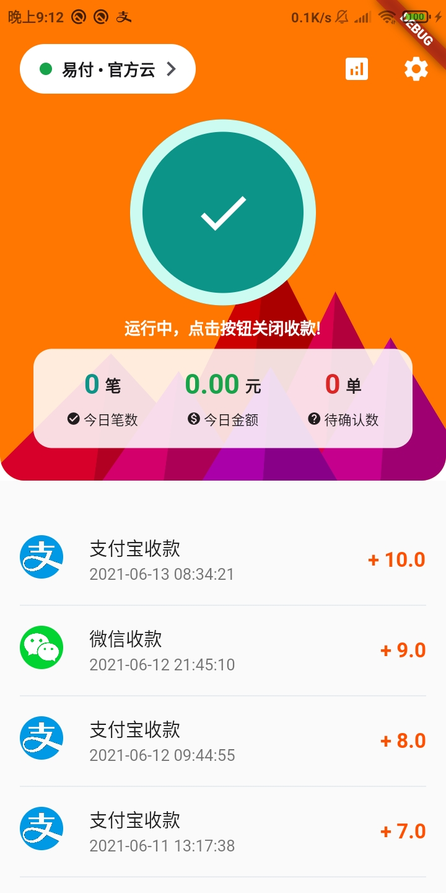
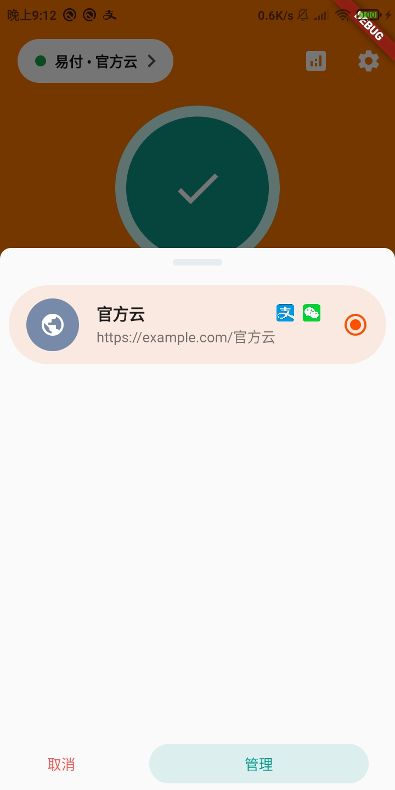
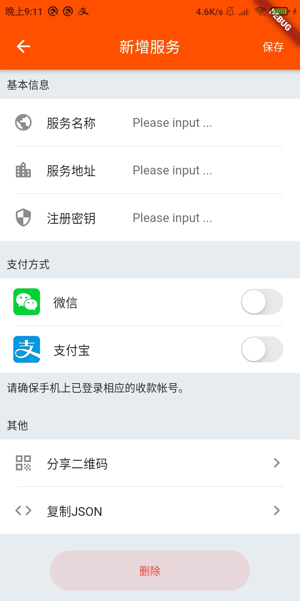
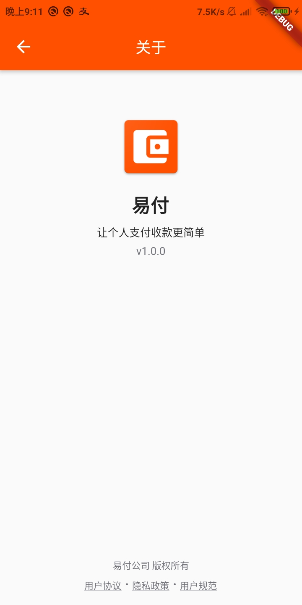

# `payserver`

**A easy way to get paid.**

---

## Feature

- **Real time notification**: notify the server if device had received payment notifacatoin.
- **Multi platforms**: both support Android and iOS.
- **Automatically and manually**: never miss any payment notifications.
- **Simple API**: easy to add to your own service.

## Preview

|Stat Pannel|Change Server|Add Server|About|
|:---:|:---:|:---:|:---:|
|||||

## Get Start

## TODO

- [ ] Analysis the orders
- [ ] Manually mark orders