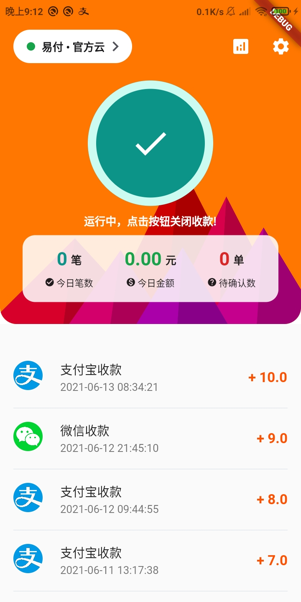
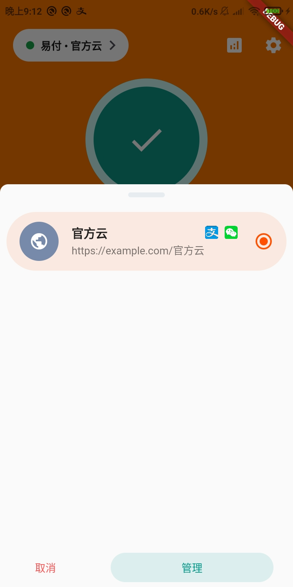
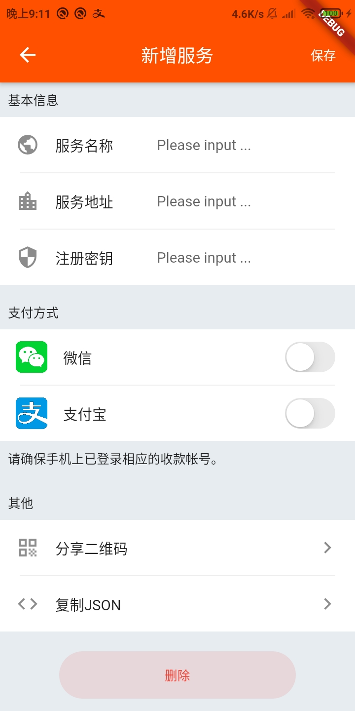
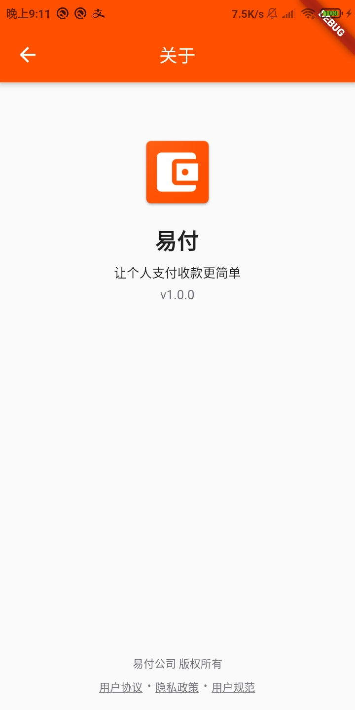

# `payserver`

**A easy way to get paid. 使用个人支付，让收款更简单。**

*:warning: 由于目前个人收款的政策调整，本项目暂时停止开发，待政策明确后继续。---2021.10*
  

---

## 特点

- **实时通知**: 设备收到付款时立即通知后端服务
- **多平台支持**: 支持Android和iOS(部分)
- **自动和手动模式**: 支持手动模式，不错过任何一笔收款
- **简单的API**: 轻松地集成到你的服务中
- **SaaS和独立部署**: 提供SaaS服务，亦可独立部署

## 预览

|开始|选择服务|添加服务|关于|
|:---:|:---:|:---:|:---:|
|||||

## 开始使用

`TODO`

## 文档

| 文档 | 说明 |
|------|------|
| [架构设计](./docs/ARCHITECTURE.md) | 系统整体架构设计 |
| [Admin Dashboard 设计](./docs/ADMIN_DESIGN.md) | Next.js 管理后台设计 |
| [存储层设计](./docs/STORAGE_DESIGN.md) | 插件化数据库架构 |
| [Agent 升级设计](./docs/AGENT_DESIGN.md) | Flutter 端升级方案 |
| [API 规范](./docs/API.md) | RESTful API 接口文档 |

## 技术栈

### 后端
- **Go Backend**: 核心业务 API (gorilla/mux + GORM)
- **Next.js**: 管理后台 + BFF API

### 移动端
- **Flutter**: 数据采集 Agent

### 数据库
- **Supabase** (首选): 云端 PostgreSQL + Auth + Realtime
- **PostgreSQL / MySQL**: 自托管备选

## TODO

- [ ] 收款订单统计与分析报表
- [ ] 手动标记订单
- [ ] Next.js Admin Dashboard 实现
- [ ] 多数据库存储层插件
- [ ] Flutter Agent 升级到 3.x
